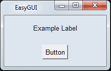
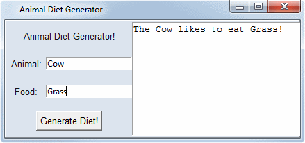

# easy_gui

easy_gui is a high-level Python library designed to simplify the process of creating GUI applications by wrapping tkinter.  Solving problems is tricky enough... using our solutions should be EASY!

# Quickstart

  - Installing easy_gui is easy enough.  Simply use pip:
  ```
  pip install easy_gui
  ```

  - To create an application with easy_gui, subclass the easy_gui.EasyGUI class and add elements in the init method.

  - Here is the most simple example:
  ```
  import easy_gui

  class GUI(easy_gui.EasyGUI):
      def __init__(self):
          self.add_widget(type='label', text='Example Label')
          self.add_widget(type='button', text='Button', command_func=lambda x: print('TEST'))

  application = GUI()
  ```
  


  - Now for a more substantial example that also shows CSS-style layout capabilities.  See the script examples/simple_gui.py for this code with additional explanatory comments:
  ```
  import easy_gui

  class GUI(easy_gui.EasyGUI):
      def __init__(self):
          self.title('Animal Diet Generator')
          self.geometry("425x170")

          section = self.add_section('example_section')
          section.configure_grid(['title             title         output',
                                  'label1            entry1        output',
                                  'label2            entry2        output',
                                  'run_button      run_button      output'])
          section.add_widget(type='label', text='Animal Diet Generator!', grid_area='title')
          section.add_widget(type='label', text='Animal:', grid_area='label1')
          self.animal = section.add_widget(type='entry', grid_area='entry1')
          section.add_widget(type='label', text='Food:', grid_area='label2')
          self.food = section.add_widget(type='entry', grid_area='entry2')
          section.add_widget(type='stdout', grid_area='output')
          section.add_widget(type='button', text='Generate Diet!', grid_area='run_button', command_func=self.diet)

      def diet(self, event):
          print(f'The {self.animal.get()} likes to eat {self.food.get()}!')

  application = GUI()
  ```
  


# Features

  - Quickly and easily build a GUI by subclassing easy_gui.EasyGUI
  - Add easy_gui Widget objects:
    - Button, Label, Entry, LabelEntry, CheckBox, DropDown, ListBox, Table, Tree, MatplotlibPlot, ProgressBar, ScrolledText, StdOutBox, DatePicker
  - Create one or more Sections (including nested Sections) to help organize GUI elements
  - CSS Grid-style layouts
  - Simply create a popup window using EasyGUI.popup()
  - Easily use multithreading for GUI responsiveness (set "separate_thread=True" when creating a Button Widget)


License
----
MIT
